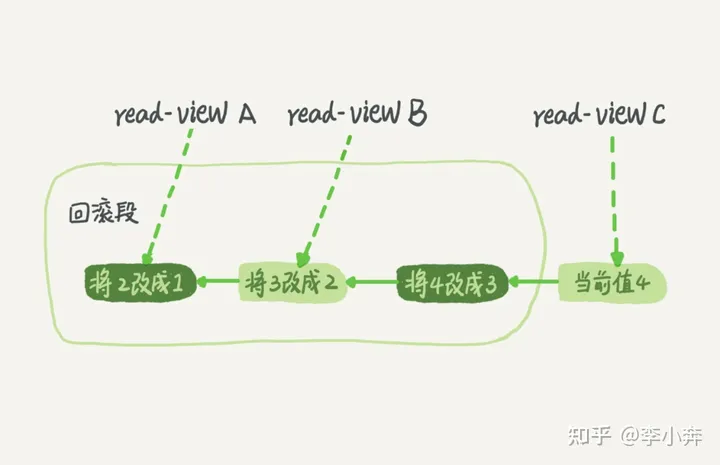

# 1、数据库的四大特性

```text
    1.隔离性：每个事务之间互不干扰
    
    2.一致性：数据一致性，事务执行前后数据库都必须保持一致
    
    3.原子性：事务包含的操作要么全部成功，要么全部失败回滚
    
    4.持久性：事务一旦提交，对数据库中的数据改变将会是永久的
```

# 2、事务并发可能出现的情况

```text
    1、脏读：一个事务读到了另一个未提交事务修改过的数据
    
    2、幻读：一个事务先根据某些条件查询出一些记录，之后另一个事务又向表中插入了符合这些条件的记录，
            原先的事务再次按照该条件查询时，能把另一个事务插入的记录也读出来。
            （幻读在读未提交、读已提交、可重复读隔离级别都可能会出现）
    
    3、不可重复读：一个事务只能读到另一个已经提交的事务修改过的数据，并且其他事务每对该数据进行一次修改并提交后，
        该事务都能查询得到最新值。（不可重复读在读未提交和读已提交隔离级别都可能会出现）
    

```

# 3、事务隔离级别

```text
    隔离级别的作用就是让事务之间互相隔离，互不影响，这样可以保证事务的一致性。

    隔离级别比较：可串行化>可重复读>读已提交>读未提交
    
    MySQL默认的隔离级别也是可重复读
    
    1、读未提交：事务A可以读取到事务B修改过但未提交的数据
    
    2、读已提交：事务B只能在事务A修改过并且已提交后才能读取到事务B修改的数据
    
    3、可重复读：事务B只能在事务A修改过数据并提交后，自己也提交事务后，才能读取到事务B修改的数据
    
    4、可串行化：
```

# 4、隔离级别的实现原理

```text
    
    假设一个值从 1 被按顺序改成了 2、3、4，在回滚日志里面就会有类似下面的记录
    
    
    同一条记录在系统中可以存在多个版本，就是数据库的多版本并发控制（MVCC）
    
    提问：回滚操作日志（undo log）什么时候删除？
        MySQL会判断当没有事务需要用到这些回滚日志的时候，回滚日志会被删除。
    提问：什么时候不需要了？
        当系统里么有比这个回滚日志更早的read-view的时候
```